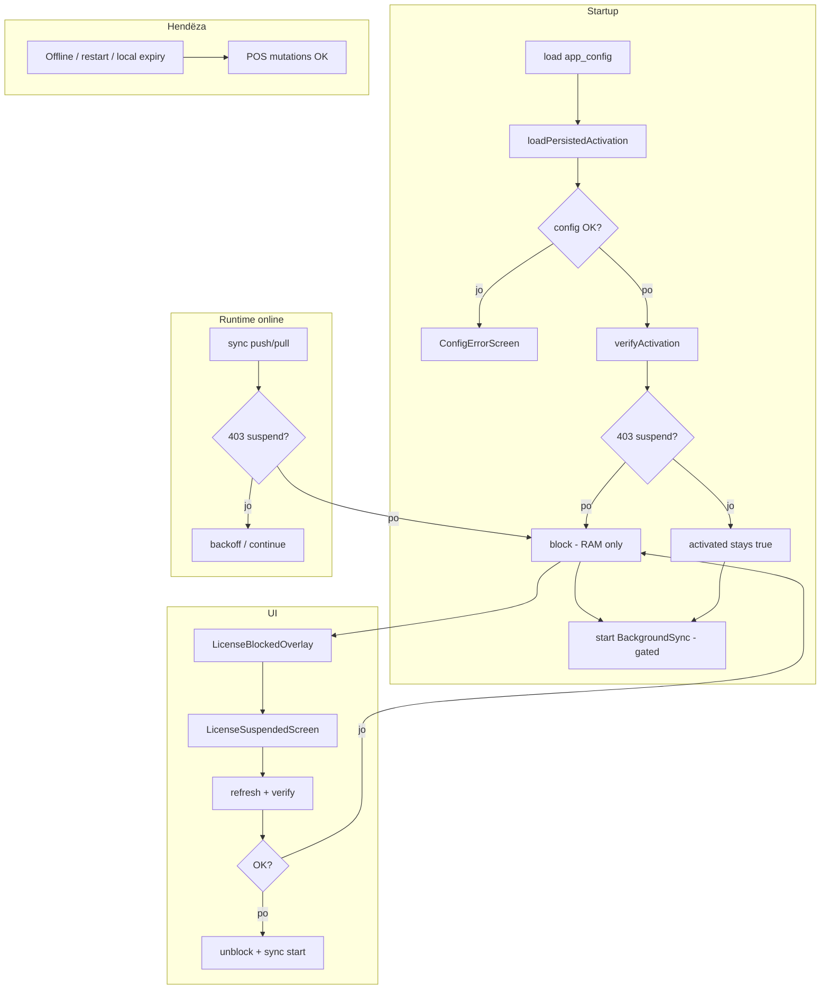

# Audit: Gjendja e bllokimit të licencës — Desktop POS

**Projekti:** `pos_system` (Flutter desktop)  
**Data e auditit:** 2026-05-23  
**Qëllimi:** Dokumentim i plotë i gjendjes aktuale — **pa ndryshime kodi**.  
**Pyetja kryesore:** Kur licenca skadon ose pezullohet, a bllokon desktop POS menjëherë dhe a parandalon përdorimin?

---

## Përmbledhje ekzekutive

| Pyetje | Përgjigje e shkurtër |
|--------|----------------------|
| Bllokim i menjëhershëm kur licenca skadon online? | **Jo gjithmonë.** Bllokimi varet nga një thirrje API që kthen **HTTP 403** dhe nga heuristika e mesazhit. Nuk ka kontroll lokal të `activation_license_expires_at`. |
| A mund të përdoret POS pas skadimit? | **Po, në disa skenarë:** offline, para sync/verify, pas rinisjes së app-it (gjendja e bllokimit nuk ruhet), ose 403 me mesazh që nuk përputhet me heuristikën. |
| A është i sigurt për prodhim? | **Jo** — duhen ndryshime para prodhimit të plotë (shiko §8–§10). |

Mekanizmi kryesor: `LicenseGateService` (në memorie) + `LicenseBlockedOverlay` (UI mbi të gjithë app-in). **Nuk ka** mbrojtje në shtresën e shërbimeve / SQLite për mutacionet POS.

---

## 1. Rruga e aktivizimit (Activation flow)

### 1.1 Skedarët kryesorë

| Skedar | Roli |
|--------|------|
| `lib/services/activation_service.dart` | Aktivizim, verify, refresh, revoke; lidhje me `LicenseGateService` |
| `lib/services/secure_activation_token_store.dart` | Tokena Bearer/refresh në keychain (jo SQLite) |
| `lib/services/runtime_config_service.dart` | URL API nga `app_config.json` / env |
| `lib/config/api_config.dart` | Path-et e endpoint-eve |
| `lib/main.dart` | Startup: config → aktivizim → verify → sync |

### 1.2 `activation_service.dart`

**Cikli i jetës (si në komente L21–27):**

1. `loadPersistedActivation()` — restauron `app_meta` + tokena nga `SecureActivationTokenStore`
2. `validateActivationKey()` — `POST /activation/validate-key` (ekran aktivizimi)
3. `activateDesktop()` — `POST /activation/desktop`
4. `verifyActivation()` — `GET /activation/verify` në startup

**Metadata lokale (`app_meta`):**

- `activation_completed`, `activation_business_id`, `activation_branch_id`, `activation_device_id`
- `activation_license_expires_at` — ruhet në aktivizim/refresh, **por nuk lexohet kurrë për bllokim** (vetëm diagnostikë në `support_bundle_service.dart`)

**`verifyActivation()` (L378–407):**

| Rezultat API | Veprim | `isActivated` | `LicenseGateService` |
|--------------|--------|---------------|----------------------|
| 200 OK | `return true` | mbetet `true` | — |
| 403 + `isLicenseSuspendedError` | `block()`, `return false` | **mbetet `true`** | `blocked = true` |
| 401 (revokim pajisje) | `handleRevokedByServer()` | `false` | — |
| Gabim rrjeti / timeout | `return false` | **mbetet `true`** | nuk bllokohet |
| Tjetër | `return false` | zakonisht `true` | — |

**Rëndësi:** Pas 403 në verify, aktivizimi **nuk** fshihet (ndryshe nga revoke). Tokenat mbeten — qëllimisht, për riprovim pas rinovimit.

**`refreshActivationToken()` (L410–457):**

- `POST /activation/refresh` me refresh token të ruajtur
- 403 suspend → `LicenseGateService.instance.block()`, pastaj `rethrow`
- Sukses → ruan tokena të rinj, përditëson `activation_license_expires_at`, `ApiClient.setAccessToken`, **`unblock()`**

### 1.3 `secure_activation_token_store.dart`

- Ruajtje: `FlutterSecureStorage` (Windows DPAPI, macOS Keychain, Linux libsecret)
- Debug: fallback në memorie + skedar `.pos_activation_tokens_debug.json` (vetëm debug)
- Release: dështim i ruajtjes → `rethrow` (aktivizimi nuk vazhdon pa tokena)
- **Nuk** mban gjendje “license blocked” — vetëm tokena

### 1.4 `runtime_config_service.dart` dhe `app_config.json`

**Prioriteti i URL-së:**

1. `app_config.json` pranë ekzekutuesit (Windows/Linux: pranë `.exe`; macOS: `Contents/Resources/` ose pranë `.app`)
2. Variabla `POS_API_BASE_URL`
3. Debug: `release/app_config.json` ose cwd
4. Fallback `http://127.0.0.1:3000` (vetëm debug)

**Shembull:** `release/app_config.example.json` → `{ "apiBaseUrl": "https://..." }`

**`isBlockedInRelease`:** në release, localhost/fallback → app shfaq `ConfigErrorScreen` (jo overlay licencë). Kjo është bllokim **konfigurimi**, jo licencë tenant.

**Licenca:** `app_config.json` **nuk** përmban status licence — vetëm URL API.

### 1.5 `GET /activation/verify`

- Path: `kEndpointVerifyActivation` = `/activation/verify` (`api_config.dart` L17–18)
- Header: Bearer nga `SecureActivationTokenStore` (përmes interceptor-it të `ApiClient`)
- Thirret në `main.dart` L88–91 pas `loadPersistedActivation()`, nëse config OK dhe pajisja aktivizuar

### 1.6 Çfarë ndodh kur verify kthen **403**

1. `LicenseGateService.isLicenseSuspendedError(e)` → nëse `true`, `block()` (pa arsye nga trupi i përgjigjes — përdoret mesazhi default)
2. `verifyActivation()` kthen `false`
3. **`ActivationService.isActivated` mbetet `true`** — nuk thirret `revokeActivation()`
4. Në `main.dart`, kushti `if (ActivationService.instance.isActivated)` është ende i vërtetë → **`BackgroundSyncService.instance.start()` ekzekutohet**
5. Sync-i i ardhshëm anashkalon push/pull kur `isBlocked` (por shërbimi mbetet “running”)
6. UI: `LicenseBlockedOverlay` në `MaterialApp.builder` shfaq `LicenseSuspendedScreen` mbi të gjithë app-in

**403 që nuk klasifikohet si suspend** (mesazh pa fjalët `suspend`, `not active`, `expired`, `pezull`): **nuk** bllokon — `verify` kthen vetëm `false`, përdoruesi vazhdon pa overlay.

---

## 2. `LicenseGateService` dhe UI e bllokimit

### 2.1 `lib/services/license_gate_service.dart`

**Gjendje:**

- `_blocked` (bool), `_reason` (String?) — **vetëm në memorie** (`ChangeNotifier`)
- **Nuk** persistohet në SQLite / `app_meta` / secure storage

**API:**

| Metodë | Sjellje |
|--------|---------|
| `block({String? reason})` | `_blocked = true`, `_reason = reason ?? 'Licenca është pezulluar. Kontaktoni administratorin.'`, `notifyListeners()` |
| `unblock()` | Pastron gjendjen, `notifyListeners()` |
| `isLicenseSuspendedError(DioException)` | Kërkon `statusCode == 403`; pastaj heuristikë në `message` |

**“Kode arsye” formale:** **Nuk ekzistojnë** enum/konstanta si `LICENSE_EXPIRED`, `BUSINESS_SUSPENDED`, etj. Vetëm analizë teksti në mesazhin e përgjigjes:

```dart
lower.contains('suspend') ||
lower.contains('not active') ||
lower.contains('expired') ||
lower.contains('pezull');
```

**Rregull special:** nëse 403 ka `message` null/bosh → konsiderohet **suspend** (`return true`).

**Kufizim:** 403 me kod strukturor (p.sh. `{ "code": "LICENSE_EXPIRED" }` pa fjalë në `message`) mund të **mos** aktivizojë bllokimin.

### 2.2 `lib/widgets/license_blocked_overlay.dart`

```dart
Stack(
  children: [
    child,  // i gjithë MaterialApp / navigimi
    if (blocked) ...[
      ModalBarrier(dismissible: false, color: Colors.black54),
      Positioned.fill(child: LicenseSuspendedScreen()),
    ],
  ],
)
```

- Vendosur në `PosSystemApp.build` → `MaterialApp.builder` (`main.dart` L181–182)
- Mbulon **të gjitha** ekranet (Login, dashboard, POS, dialogët në të njëjtin navigator tree)

**A bllokon klikimet?**

- `ModalBarrier(dismissible: false)` ndalon hit-test te widgetët poshtë në stack
- `LicenseSuspendedScreen` është sipër — merr inputin e ekranit të bllokuar
- **Nuk** përdoret `AbsorbPointer` në rrënjë; mbrojtja është vizuale/UI, jo në `ManagerData` / repository

**Shkurtore tastiere:** nuk ka barrier global për keyboard në overlay; rreziku i ulët nëse fokusi mbetet në shtresën e sipërme, por **nuk** ka garanci në shtresën e të dhënave.

### 2.3 `lib/screens/license_suspended_screen.dart`

**UI:**

- Titull: “Aksesi i pezulluar”
- Tekst: `LicenseGateService.instance.reason`
- Buton: **“Kontrollo statusin”** (jo “Riprovo” literal, por funksion riprovimi)

**Rruga e riprovimit (`_retryStatusCheck`):**

1. `ActivationService.refreshActivationToken()` → `POST /activation/refresh`
2. `ActivationService.verifyActivation()` → `GET /activation/verify`
3. Nëse `ok && !isBlocked` → `unblock()` + `BackgroundSyncService.instance.start()`
4. Nëse ende suspend → mesazh “Licenca është ende pezulluar…”
5. Gabim lidhjeje → “Nuk ka lidhje me serverin…”

**Unblock:** po, përmes `LicenseGateService.unblock()` pas refresh+verify të suksesshëm.

**Ruajtja e kartës/tavolinës:** po — **nuk** thirret `revokeActivation()`; SQLite dhe sesioni POS mbeten.

### 2.4 Provider / listener të tjerë

- `LicenseGateService` extends `ChangeNotifier` — `ListenableBuilder` në overlay
- `ActivationStateController` — **vetëm** për aktivizim/revoke pajisje, **jo** për license suspend
- Asnjë `Provider`/`Riverpod` i dedikuar për license gate

---

## 3. Sjellja e dështimit të sync

### 3.1 `lib/services/background_sync_service.dart`

**Ku kontrollohet `isBlocked`:**

| Vend | Efekt |
|------|--------|
| `triggerSyncNow` L164–169 | Anashkalon push |
| `pullSyncNow` L400–404 | Anashkalon pull |
| `_onConnectivityChanged` L613 | Nuk nis sync pas online |
| `_requestSyncWhenReady` L626 | Nuk planifikon sync |
| `_ensureRetryScheduled` L682 | Nuk planifikon retry |
| `_idlePushTick` L717 | Nuk push-on outbox |

**`_handleLicenseSuspended` (L534–543):**

```dart
if (!LicenseGateService.isLicenseSuspendedError(error)) return false;
LicenseGateService.instance.block();
stop();  // BackgroundSyncService.stop()
_recordFailureAndSchedule('License suspended — sync paused');
return true;
```

Thirret nga: push (L228, L332), pull (L424, L484), refresh token gjatë 401 (L515).

**403 në push/pull:** po, vendos `LicenseGateService.block()` dhe ndalon sync-in.

**Kode të unifikuara (`BUSINESS_SUSPENDED`, `LICENSE_EXPIRED`, …):** **nuk** përdoren në desktop — vetëm heuristika 403 + mesazh.

**401 vs 403** (dokumentuar edhe në `docs/21_DESKTOP_REVOKED_DEVICE_BEHAVIOR.md`):

| HTTP | Desktop | Tokena | UI |
|------|---------|--------|-----|
| 401 | Revoke pajisje (`handleRevokedByServer`) | Fshihen | `DeviceRevokedScreen` |
| 403 (suspend) | `block()`, tokena mbeten | Overlay licencë |

**`DEVICE_REVOKED` / `DEVICE_SUSPENDED`:** nuk ka emërtime kodi; 401 trajtohet si revokim pajisje (heuristikë mesazhi në `shouldTreatAsDeviceRevocation` / `messageForRevocation`).

### 3.2 A vendos sync `LicenseGateService`?

| Burim | `block()`? | `stop()` sync? |
|-------|------------|----------------|
| Push/pull 403 suspend | Po | Po |
| Verify startup 403 | Po | **Jo** (sync start ende në `main`) |
| Refresh 403 | Po | Varësisht kontekstit |
| Gabim rrjeti sync | Jo | Jo (backoff) |

### 3.3 A ndalet POS UI?

- Overlay shfaqet kur `isBlocked == true` (pas `notifyListeners`)
- **Jo** automatikisht në çdo dështim sync — vetëm nëse 403 klasifikohet si suspend
- Mutacionet lokale **mund** të vazhdojnë nëse overlay nuk është aktiv (offline, restart, 403 i paklasifikuar)

### 3.4 Retry

- Sync: backoff + timer — **nuk** vazhdon kur `isBlocked`
- Përdoruesi: butoni “Kontrollo statusin” në `LicenseSuspendedScreen` (refresh + verify), jo retry sync direkt

---

## 4. Mbrojtja e ndërveprimit POS

### 4.1 Modeli aktual i mbrojtjes

**Një shtresë:** overlay UI në `MaterialApp.builder`.

**Zero referenca** te `LicenseGate` / `isBlocked` në:

- `lib/manager/` (të gjitha mutacionet e shitjeve)
- `lib/screens/pos_order_screen.dart`
- `lib/screens/login_screen.dart`, `manager_dashboard_screen.dart`, etj.

### 4.2 Kur licenca është e bllokuar (overlay aktiv)

| Veprim | Mbrojtur? | Shënim |
|--------|-----------|--------|
| Hyrje PIN / login | Po (UI) | Nuk arrihet poshtë barrier-it |
| Shtim/heqje artikujsh, porosi | Po (UI) | |
| Pagesë | Po (UI) | |
| Hapje/mbyllje turni | Po (UI) | |
| Tavolina | Po (UI) | |
| Cilësime / sync diagnostics | Po (UI) | Dialogët në të njëjtin tree mbulohen |

### 4.3 Kur licenca **duhet** të jetë e pavlefshme por overlay **nuk** është aktiv

| Veprim | Mbrojtur? | Rrezik |
|--------|-----------|--------|
| Të gjitha veprimet POS | **Jo** | Offline pas skadimit; para sync të parë; pas restart pa verify 403; 403 me mesazh “i gabuar” |
| Shkrim SQLite / outbox | **Jo** | `ManagerData` nuk kontrollon licencën |
| Sync push | Pjesërisht | Anashkalohet kur `isBlocked`; outbox akumulohet offline |

### 4.4 Veprime “të rrezikshme” pa guard në shtresë shërbimi

- Regjistrim shitjeje + outbox offline → të dhëna lokale pa sinkronizim të licencuar
- Void / rregullime (nëse ekzistojnë në UI) — e njëjta logjikë
- Backup/restore — nuk lidhet me license gate (kontroll i veçantë PIN admin)

---

## 5. Sjellja në startup

### 5.1 Renditja (`main.dart`)

1. `RuntimeConfigService.load()` + `ApiClient.configureBaseUrl`
2. `ApiClient.onUnauthorizedRevoke` → 401 revoke (jo 403)
3. `BackgroundSyncService.initialize()`
4. `ActivationService.loadPersistedActivation()`
5. Nëse `!configBlocked` dhe aktivizuar → **`verifyActivation()`**
6. Nëse ende `isActivated` → **`BackgroundSyncService.start()`**
7. `SyncStatusService.start()`
8. `runApp`

### 5.2 Licencë e skaduar para përdorimit të POS

| Skenar | Bllokim para POS? |
|--------|-------------------|
| Online, verify 403 + heuristikë OK | **Po** — overlay që nga frame i parë (pas `block()` para `runApp`) |
| Online, verify gabim rrjeti | **Jo** — përdoruesi hyn normalisht |
| Online, verify 403 pa heuristikë | **Jo** |
| Offline në startup | **Jo** — verify kthen `false`, nuk bllokon |
| Skadim vetëm lokal (`activation_license_expires_at`) | **Jo** — nuk kontrollohet |

### 5.3 API e paarritshme në startup

- `verifyActivation()` → `return false`, **pa** `block()`
- Aktivizimi mbetet; sync start (por push/pull dështojnë offline)
- Përdoruesi përdor POS normalisht

### 5.4 Gjendja e fundit ishte blocked

- **Humbet** në restart — `_blocked` është vetëm RAM
- Pas restart: overlay **jo** derisa verify/sync të marrë 403 përsëri
- Dritare e shkurtër “të zbrazët” ku përdoruesi mund të veprojë derisa verify të përfundojë (race në startup)

---

## 6. Sjellja offline

| Pyetje | Gjendja aktuale |
|--------|-----------------|
| A vazhdon POS offline pas skadimit? | **Po**, nëse overlay nuk u aktivizua më parë ose u humb në restart |
| A përdoret cache licence? | `activation_license_expires_at` ruhet, **por nuk përdoret** për vendim bllokimi |
| Hard stop offline? | **Jo** |
| Politika aktuale | “Vazhdo offline derisa API të kthejë 403 të klasifikuar ose përdoruesi të riprovojë me sukses” |

**Pas rikthimit online:** idle sync (çdo ~5 s kur ka outbox) ose connectivity → push/pull → 403 → `block()` + overlay.

---

## 7. Çkyçje pas rinovimit (SuperAdmin)

| Hapi | Implementim |
|------|-------------|
| SuperAdmin rinovon / riaktivizon licencën në cloud | Jashtë desktop |
| Operatori në desktop | Ekrani “Aksesi i pezulluar” → **“Kontrollo statusin”** |
| Thirrje API | `POST /activation/refresh` pastaj `GET /activation/verify` |
| Sukses | `unblock()`, `BackgroundSyncService.start()`, overlay zhduket |
| Dështim ende suspend | Mesazh “Licenca është ende pezulluar…” |
| Ruajtje lokale | Kartë, tavolinë, shitje — **pa** wipe (tokena nuk fshihen) |

**Nuk** thirret përsëri `POST /activation/desktop` për unblock — mjafton refresh + verify me tokena ekzistuese.

---

## 8. Hendëzat aktuale (tabela severiteti)

| Hendëz | Severity | Risk | Rekomandim |
|--------|----------|------|------------|
| Licenca e skaduar nuk bllokon menjëherë (vetëm kur API 403 + heuristikë) | **Kritik** | Përdorim pa pagesë licence derisa sync/verify | Kontroll lokal `licenseExpiresAt` + verify periodik |
| Bypass offline pas skadimit / restart | **Kritik** | Shitje të pakontrolluara, outbox i pasync-uar me licencë të pavlefshme | Politikë offline: hard stop ose grace i kufizuar + persist `blocked` |
| Gjendja `blocked` vetëm në RAM | **Kritik** | Pas restart POS i hapur derisa verify | Persist `license_blocked` në `app_meta` + restore në startup |
| Mungon kontroll periodik licence | **Lartë** | Skadim midis sesionit pa sync | Timer: verify çdo N minuta |
| Mungon mapping i kodeve (`LICENSE_EXPIRED`, `BUSINESS_SUSPENDED`, …) | **Lartë** | 403 nuk bllokon nëse API ndryshon format | Parse `code` nga JSON + map eksplicit |
| Overlay vetëm UI — pa guard në `ManagerData`/shitje | **Lartë** | Race startup, keyboard, bug stack | `LicenseGateService.enforceOrThrow()` në mutacione |
| `verify` 403 nuk thërret `BackgroundSyncService.stop()` | **Mesatar** | Sync “running” por i gated — konfuzion diagnostikë | `stop()` në `block()` qendror |
| `block()` nuk vendos `reason` nga përgjigja API | **Mesatar** | UX e dobët | Parse `message` / `code` në `block(reason: …)` |
| 403 me mesazh bosh → gjithmonë suspend | **Mesatar** | Bllokim i gabuar për 403 të tjera | Kërko fushë `code` zyrtare |
| Pa teste unit për `LicenseGateService` | **Mesatar** | Regresione | `test/license_gate_service_test.dart` |
| Emërtimi “Kontrollo statusin” vs “Riprovo” | **I ulët** | Konfuzion operatori | Copy UX |

---

## 9. Plan i propozuar (implementim i ardhshëm — **jo** i implementuar)

### 9.1 `LicenseGateService` qendror

- Singleton me: `blocked`, `reasonCode`, `reasonMessage`, `blockedAt`, `source` (verify/sync/local-expiry)
- `block(LicenseBlockReason code, {String? message})` / `unblock()` / `assertNotBlocked()` për shërbime
- Persist në `app_meta`: `license_gate_blocked`, `license_gate_reason_code`, `license_gate_blocked_at`
- Në `loadPersistedActivation()`: restaurim gjendje + verify nëse online

### 9.2 Overlay full-screen

- Mbaj `LicenseBlockedOverlay` + `ModalBarrier`
- Shto `AbsorbPointer` / `Focus` që garanton zero interaksion
- Opsional: `Shortcuts` që injorojnë tastiera kur blocked

### 9.3 Mapping HTTP 403

```text
API code (shembull)     → LicenseBlockReason
LICENSE_EXPIRED         → licenseExpired
LICENSE_SUSPENDED       → licenseSuspended
BUSINESS_SUSPENDED      → businessSuspended
DEVICE_SUSPENDED        → deviceSuspended (403, jo revoke)
```

- Fallback në heuristikë aktuale për përputhshmëri
- `ApiClient` interceptor: 403 → `LicenseGateService.tryBlockFromResponse()`

### 9.4 Verifikim periodik

- `Timer.periodic` (p.sh. 15–30 min) → `verifyActivation()`
- Pas connectivity online → verify menjëherë
- Në `block()`: `BackgroundSyncService.stop()` njëherësh

### 9.5 Startup

- Para `runApp`: load persisted block + `verifyActivation()` nëse online
- Nëse `licenseExpiresAt` < now (UTC) → `block(localExpiry)` edhe offline
- Mos starto sync derisa `!isBlocked`

### 9.6 Retry / unlock

- Buton “Riprovo” → refresh + verify (ekziston, përmirëso copy)
- Opsional: sync push një batch pas unblock për të pastruar outbox
- Dokumentim për operator: rinovim SuperAdmin → “Riprovo” në desktop

### 9.7 Politika offline

Opsione (zgjedhje produkti):

- **A (strict):** pas skadimit lokal → bllokim edhe offline
- **B (grace):** 24–72 h offline me `licenseExpiresAt` + verify në rimarrje
- **C (aktual, dokumentuar):** vazhdo derisa 403 — **nuk rekomandohet për prodhim**

---

## 10. Verdikt final

### 10.1 A është desktop i sigurt kundër licencave të skaduara?

**Jo plotësisht.** Ka infrastrukturë të mirë (overlay, ndarje 401/403, refresh për rikthim), por mbrojtja është **reaktive**, **heuristike**, **jo e persistuar**, dhe **vetëm në UI**.

### 10.2 A mund të përdorin POS nëse licenca ka skaduar?

| Kontekst | Përdorim POS |
|----------|--------------|
| Online, 403 i klasifikuar | **Jo** (overlay) |
| Online, para verify/sync të parë | **Po** (dritare e shkurtër) |
| Offline pas skadimit | **Po** |
| Pas restart (pa 403 të ri menjëherë) | **Po** |
| Skadim vetëm në DB lokale (`activation_license_expires_at`) | **Po** |

### 10.3 Çfarë duhet rregulluar para prodhimit

1. Bllokim i persistuar + restaurim në startup  
2. Kontroll lokal i datës së skadimit (`activation_license_expires_at`)  
3. Verify periodik + verify në rimarrje online  
4. Mapping zyrtar i kodeve 403 nga pos_api  
5. Guard në shtresën e mutacioneve (shitje, pagesë, turne) — jo vetëm overlay  
6. Politikë offline e qartë (rekomandohet strict ose grace i dokumentuar)  
7. Teste automatike për gate + verify + sync 403  

### 10.4 Skedarët për ndryshim në fazën e ardhshme

| Skedar | Ndryshim i pritur |
|--------|-------------------|
| `lib/services/license_gate_service.dart` | Persist, kode, `enforce`, parse response |
| `lib/services/activation_service.dart` | Local expiry, reason nga API, verify policy |
| `lib/main.dart` | Startup block restore, mos start sync kur blocked |
| `lib/widgets/license_blocked_overlay.dart` | AbsorbPointer / focus |
| `lib/screens/license_suspended_screen.dart` | Copy “Riprovo”, UX |
| `lib/services/background_sync_service.dart` | `stop()` në block qendror; kode 403 |
| `lib/services/api_client.dart` | Interceptor 403 → gate (opsional) |
| `lib/manager/manager_data*.dart` | Guard në mutacione kritike |
| `lib/services/database_service.dart` / migrim | Meta keys për license gate |
| `test/license_gate_service_test.dart` | **I ri** |

---

## Diagram i rrjedhës (gjendja aktuale)



---

## Referenca në repo

- `docs/21_DESKTOP_REVOKED_DEVICE_BEHAVIOR.md` — 401 vs 403  
- `docs/99_POS_SYSTEM_REMAINING_WORK_AUDIT.md` — suspend/reactivate ⚠️ partial  
- `docs/28_SYNC_PIPELINE_AUDIT.md` — gate sync kur `isBlocked`  
- `docs/DESKTOP_BACKEND_INTEGRATION.md` — `activation_license_expires_at`  

---

*Dokument vetëm analizë. Asnjë ndryshim kodi, sync, ose UI nuk u bë gjatë këtij auditi.*
