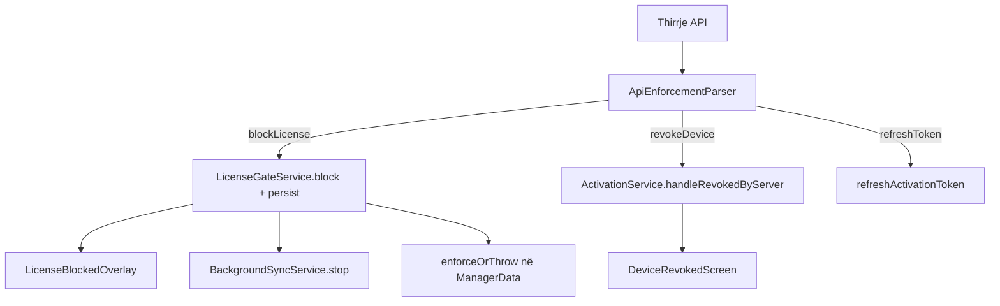

# Desktop — Hard License Enforcement (pos_api codes)

**Data:** 2026-05-23  
**Projekti:** `pos_system`  
**Përputhje:** pos_api me `response.code` standardizuar

---

## Çfarë u ndryshua

| Skedar | Ndryshim |
|--------|----------|
| `lib/services/api_enforcement_parser.dart` | **I ri** — parser qendror `code` → veprim |
| `lib/services/license_gate_service.dart` | Refaktor: enum, persist `app_meta`, `enforceOrThrow`, pa heuristikë |
| `lib/services/activation_service.dart` | verify/refresh me body + codes; revoke pastron gate |
| `lib/services/background_sync_service.dart` | 403/401 me parser; `DEVICE_REVOKED` → revoke |
| `lib/main.dart` | Startup: load gate, expiry strict, sync vetëm nëse `!isBlocked` |
| `lib/screens/license_suspended_screen.dart` | Buton **"Riprovo"**; parser në catch |
| `lib/manager/manager_data*.dart` | `enforceOrThrow()` në shitje, tavolina, turne |
| `test/api_enforcement_parser_test.dart` | **I ri** |
| `test/license_gate_service_test.dart` | **I ri** |
| `test/activation_revoke_test.dart` | Kodet `DEVICE_REVOKED` / `LICENSE_SUSPENDED` |

**Nuk u ndryshua:** layout UI, schema domain SQLite, arkitektura sync, JWT/activation flow bazë.

---

## Flow i ri (runtime)



---

## Startup flow (`main.dart`)

1. `loadPersistedActivation()`
2. Nëse aktivizuar dhe config OK:
   - `LicenseGateService.loadPersistedState()`
   - `checkAndBlockIfLocallyExpired()` (STRICT offline)
   - `verifyActivation()` vetëm nëse `!isBlocked`
3. `BackgroundSyncService.start()` vetëm nëse aktivizuar **dhe** `!isBlocked`
4. `runApp()` — pa dritare të hapur para verify kur online (verify përfundon para UI)

`LicenseGateService.onBlocked` → `BackgroundSyncService.stop()` (shmang import circular).

---

## Offline behavior (STRICT)

- Lexohet `activation_license_expires_at` nga `app_meta`
- Nëse `now > expiresAt` → `block(licenseExpired)` edhe **pa internet**
- Gjendja ruhet në `license_gate_*` meta → mbetet blocked pas restart

Pa datë skadimi në meta: offline vazhdon derisa API të kthejë kod bllokimi (sjellje e vjetër për tenant pa expiry).

---

## API code mapping

| `response.code` | Veprim desktop |
|-----------------|----------------|
| `LICENSE_EXPIRED` | Overlay + persist + stop sync |
| `LICENSE_SUSPENDED` | Overlay + persist + stop sync |
| `BUSINESS_SUSPENDED` | Overlay + persist + stop sync |
| `DEVICE_SUSPENDED` | Overlay + persist + stop sync |
| `DEVICE_REVOKED` | Revoke tokena → `DeviceRevokedScreen` |
| `INVALID_REFRESH_TOKEN` | Revoke tokena |
| `TOKEN_EXPIRED` | `refreshActivationToken` (pastaj retry verify/sync) |

**Legacy:** 403 pa `code` → bllokim licence; 401 pa `code` në rrugë të mbrojtur → revoke.

Verify body: `{ "valid": false, "code": "LICENSE_EXPIRED" }` → bllokim pa heuristikë mesazhi.

---

## Revoke vs suspend

| | Suspend / skadim licence | Revoke pajisje |
|--|--------------------------|----------------|
| Tokena | **Ruhen** | **Fshihen** |
| UI | `LicenseSuspendedScreen` overlay | `DeviceRevokedScreen` |
| Rikthim | **Riprovo** → refresh + verify | Çelës aktivizimi i ri |
| SQLite biznesi | I paprekur | I paprekur |

---

## Persist `app_meta`

| Çelës | Përmbajtje |
|-------|------------|
| `license_gate_blocked` | `true` / bosh |
| `license_gate_code` | `licenseExpired`, `licenseSuspended`, … |
| `license_gate_message` | Tekst për përdoruesin |
| `license_gate_blocked_at` | ISO-8601 UTC |

---

## Hard enforcement (jo vetëm overlay)

`LicenseGateService.enforceOrThrow()` në:

- `openShift` / `closeShift`
- `recordSale` / `recordSaleWithLines`
- `saveCurrentOrder` / `updateTableTotal` / `clearTable`

---

## Risk analysis

| Risk | Mitigim |
|------|---------|
| API pa fushë `code` (version i vjetër) | Fallback 403→block, 401→revoke |
| Clock skew offline expiry | UTC; admin rinovon → refresh përditëson `licenseExpiresAt` |
| Singleton gate në teste | `clearForRevocation()` në `setUp` |
| Race para verify | Verify para `runApp` kur online |

---

## Rollback plan

1. Revert commit enforcement
2. Ose fshi manualisht `license_gate_*` nga `app_meta` në SQLite
3. Riaktivizim nëse revoke aksidental

---

## Test results

```text
flutter test test/api_enforcement_parser_test.dart \
  test/license_gate_service_test.dart \
  test/activation_revoke_test.dart
# 00:01 +17: All tests passed!
```

Mbulim:

- `LICENSE_EXPIRED` → overlay / block
- `BUSINESS_SUSPENDED` → persist restore
- `DEVICE_REVOKED` → revoke path
- Local expiry offline
- `unblock` pastron meta
- `enforceOrThrow`
- `TOKEN_EXPIRED` vs revoke

---

## Deployment steps

1. Deploy **pos_api** me `code` në përgjigje (403/401/verify body)
2. Build desktop: `flutter build windows --release`
3. `app_config.json` me URL prodhimi
4. Test manual:
   - Skadim licence → overlay → SuperAdmin renew → **Riprovo** → POS vazhdon
   - Revoke pajisje → `DeviceRevokedScreen` (jo overlay licence)
   - Restart gjatë bllokimit → mbetet blocked
   - Offline pas `activation_license_expires_at` → blocked

---

## Skenarët e suksesit (kërkesa)

| # | Pritet | Status |
|---|--------|--------|
| 1 | Skadim → lock → renew → Riprovo → unlock, vazhdim | ✅ Implementuar |
| 2 | `DEVICE_REVOKED` → revoke screen, key i ri | ✅ |
| 3 | Offline pas expiry → nuk lejon përdorim | ✅ STRICT |
| 4 | Restart blocked → blocked menjëherë | ✅ Persist |

---

*Shiko edhe `docs/40_DESKTOP_LICENSE_LOCK_STATE_AUDIT.md` për gjendjen para këtij ndryshimi.*
