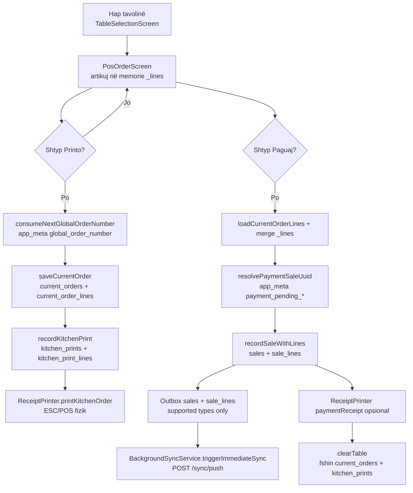

# 47 — Desktop POS: Audit i metadata-së së porosive / të ardhurave për mobile dashboard

**Data:** 2026-05-23  
**Projekti:** `pos_system` (Flutter desktop)  
**Qëllimi:** Dokumentim i plotë — çfarë krijohet lokalisht, çfarë dërgohet në API përmes sync, dhe pse mobile manager dashboard shfaq vlera bosh ose fallback.  
**Kufizim:** Vetëm analizë. **Asnjë ndryshim kodi.**

**Repo të lidhura (jashtë këtij workspace):** `pos_api` (NestJS), `mobile_dashboard` (Flutter). Përfundimet për mobile bazohen në dokumentacion ekzistues (`docs/37_…`, `docs/100_…`) dhe arkitekturë API — **jo** lexim i kodit mobil në këtë audit.

**Të lidhura:** [37_DESKTOP_MOBILE_REAL_DATA_PARITY_FIX.md](./37_DESKTOP_MOBILE_REAL_DATA_PARITY_FIX.md) · [28_SYNC_PIPELINE_AUDIT.md](./28_SYNC_PIPELINE_AUDIT.md) · [100_POS_SYSTEM_FULL_TECHNICAL_AUDIT.md](./100_POS_SYSTEM_FULL_TECHNICAL_AUDIT.md) · [13_DESKTOP_PULL_SYNC_INTEGRATION.md](./13_DESKTOP_PULL_SYNC_INTEGRATION.md)

---

## Përmbledhje ekzekutive

| Pyetja | Përgjigje e shkurtër |
|--------|---------------------|
| Pse mesatarja / ora kulmore = `—` në mobile? | Desktop i llogarit **vetëm lokalisht** (`TodaySummaryCard`). Në push dërgohen `total` + `soldAt` — **jo** metrika të agreguara. Nëse mobile/API nuk llogarisin avg/peak nga `soldAt`, UI shfaq `—`. |
| Pse kamarieri = „Kamarieri i panjohur”? | `waiterName` ruhet në SQLite `sales` / `sale_lines`, por **`SyncPushPayloadMapper` e heq në push**; PostgreSQL nuk e merr. Mobile fallback kur fusha mungon. |
| Pse titulli = „Porosia #9B1DB1F3”? | `orderNumber` **nuk ekziston** në tabelën `sales` dhe **nuk synkronizohet**. Mobile përdor prefix të `uuid` (8 karaktere heks). |
| A ruhen / sync-ohen porositë e printuara? | **Po lokalisht** (`kitchen_prints`). **Jo në cloud** — entiteti nuk është në `supportedSyncEntityTypes`. |
| A dërgon desktop të dhëna të mjaftueshme për analytics mobile? | **Pjesërisht:** revenue dhe numërim shitjesh të **paguara** (nëse push OK) përmes `total`, `soldAt`, `status`, rreshta produkti. **Jo** për: porosi të hapura, printime, kamarier, tavolinë, numër porosie, mesatare/orë kulmore të gatshme. |

---

## 1. Cikli i jetës së porosisë desktop

### 1.1 Diagram rrjedhe



### 1.2 Ku ruhen të dhënat

| Faza | Ruajtje | Tabela / burim | Sync në cloud? |
|------|---------|----------------|----------------|
| Shportë aktive (para Printo) | Vetëm RAM | `PosOrderScreen._lines` | ❌ |
| Pas **Printo** | SQLite | `current_orders`, `current_order_lines` | ❌ (outbox skip) |
| Historik printimi | SQLite | `kitchen_prints`, `kitchen_print_lines` | ❌ (outbox skip) |
| Pas **Paguaj** | SQLite | `sales`, `sale_lines` | ✅ (nëse push kalon) |
| Layout tavolinash | SQLite | `tables` (`occupied`, `assignedWaiterName`, …) | ❌ |
| Numër global porosie | SQLite | `app_meta` key `global_order_number` | ❌ |

**Skema bazë:** `lib/services/database_schema.dart` (v13+): `current_orders` (~L609), `kitchen_prints` (~L631), `sales` (~L539).

### 1.3 Metodat kryesore (emra të saktë)

| Hapi | Skedar | Metodë |
|------|--------|--------|
| Zgjedhje kamarieri | `lib/screens/waiter_selection_screen.dart` | `_selectWaiter` → `TableSelectionScreen` |
| Hap porosi | `lib/screens/table_selection_screen.dart` | navigim me `orderNumber: 0` (derisa të printohet) |
| Shtim artikujsh | `lib/screens/pos_order_screen.dart` | `_addProduct`, `_deltaQty` |
| Printo | `pos_order_screen.dart` | `_sendOrder()` |
| Paguaj | `pos_order_screen.dart` | `_payTable()` |
| Ruaj porosi aktive | `lib/manager/manager_data_tables.dart` | `saveCurrentOrder()` → `DatabaseService.upsertCurrentOrderMeta`, `replaceCurrentOrderLines` |
| Print kuzhine DB | `manager_data_tables.dart` | `recordKitchenPrint()` → `DatabaseService.insertKitchenPrint` |
| Shitje | `lib/manager/manager_data_sales.dart` | `recordSaleWithLines()` → `SalesRepository.insertSaleWithLines` → `DatabaseService.insertSaleWithLines` |
| Outbox | `database_service.dart` | `_queueOutboxByIdIfAbsent`, `_enqueueOutbox` |
| Push | `lib/services/background_sync_service.dart` | `triggerSyncNow`, `_buildSyncPushEvent` |

### 1.4 Lokale vs sync vs dashboard

| Të dhëna | Vetëm lokale | Në outbox (JSON row) | Në wire HTTP pas mapper | Mobile dashboard |
|---------|:------------:|:--------------------:|:-----------------------:|:----------------:|
| Porosi e hapur | ✅ | Tentativë → **skip** | ❌ | ❌ |
| Print kuzhine | ✅ | Tentativë → **skip** | ❌ | ❌ |
| Shitje e paguar | ✅ | ✅ | ✅ (i reduktuar) | ✅ nëse në PostgreSQL |
| Tavolina / kamarier layout | ✅ | ❌ | ❌ | ❌ |

**Mekanizmi i skip:** `lib/services/supported_sync_entity_types.dart` — vetëm 9 tipet; `_enqueueOutbox` në `database_service.dart` (~L2201) kthen pa insert kur tipi nuk mbështetet. Test: `test/supported_sync_entity_types_test.dart`.

### 1.5 Dashboard desktop vs mobile

| Burim | Lexon nga | Çfarë sheh |
|-------|-----------|------------|
| **Desktop** manager | `ManagerData.salesHistory` / SQLite `fetchSales` | Të gjitha shitjet lokale me `waiterName`, `tableId`, `timestamp` |
| **Mobile** manager | API `GET /dashboard/orders` (dok. 37) | Vetëm çfarë ka në PostgreSQL pas push |

Desktop mund të ketë **10 shitje** lokale ndërsa mobile **0** nëse push dështon (dok. 100 §10.3).

### 1.6 Porosi e printuar por e papaguar — a sync-ohet?

**Jo.** Arsye teknike:

1. Ruhet në `kitchen_prints` / `current_orders`.
2. Kodi thërret `_queueOutboxRow` / `_queueOutboxById` për këto entitete (`insertKitchenPrint` ~L383, `upsertCurrentOrderMeta` ~L191).
3. `_enqueueOutbox` refuzon tipin → **asnjë rresht outbox** nuk krijohet.
4. `pos_api` nuk ka processor për `kitchen_prints` / `current_orders`.

**Përfundim:** Porositë e printuara por të papaguara **nuk mund** të shfaqen në mobile dashboard sot.

---

## 2. Krijimi i të dhënave të shitjes (`sales`)

### 2.1 Rruga e pagesës (runtime)

`PosOrderScreen._payTable()` (`lib/screens/pos_order_screen.dart` ~L129):

1. `loadCurrentOrderLines` + `_mergeLines` me shportën aktuale.
2. `resolvePaymentSaleUuid(tableId, waiterName)` — `DatabaseService` / `app_meta` `payment_pending_{tableId}_{waiterName}`.
3. **`recordSaleWithLines`** — para printimit të faturës (commit-first).
4. `ReceiptPrinter.printKitchenOrder(..., paymentReceipt: true)` — gabimi i printerit **nuk** anulon shitjen.
5. `clearTable` — fshin porosinë aktive dhe historikun e printimeve për atë tavolinë/kamarier.

> **Korrigjim dokumentesh të vjetra:** Pagesa **nuk** është „print pastaj sale”; është **sale → print → clear**.

### 2.2 `recordSaleWithLines` → `insertSaleWithLines`

**`lib/manager/manager_data_sales.dart`** — `recordSaleWithLines` (~L39):

- Validon `waiterName` jo bosh.
- Ndërton `lineMaps` me snapshot: `productId`, `productName`, `productPrice`, `quantity`, `lineTotal`, `categoryName`, `tableName` (p.sh. `'Tavolina 5'`), `waiterName`.
- Thërret `SalesRepository.insertSaleWithLines`.

**`lib/services/database_service.dart`** — `insertSaleWithLines` (~L874):

#### Header `sales` (insert)

| Kolonë SQLite | Vlerë |
|---------------|-------|
| `waiterName` | nga pagesa |
| `tableId` | numri i tavolinës |
| `total` | shuma e tavolinës |
| `timestamp` | `syncTimestamps()['createdAt']` (UTC ISO me `Z` për rreshta të rinj) |
| `shiftId` | opsional |
| `uuid` | `saleUuid` (i qëndrueshëm për idempotencë) |
| `businessId`, `branchId`, `deviceId` | `syncScope()` |
| `syncStatus`, `createdAt`, `updatedAt` | metadata sync |

**Nuk insertohet:** `orderNumber`, `printedAt`, `status`, `paymentStatus`, `itemCount`, `tableName` (vetëm në rreshta).

#### Rreshta `sale_lines` (insert për çdo artikull)

| Kolonë | Burim |
|--------|-------|
| `saleId` | FK lokale |
| `productId`, `productName`, `productPrice`, `quantity`, `lineTotal` | snapshot |
| `productEmoji`, `productImagePath`, `categoryName` | snapshot menu |
| `tableName`, `waiterName` | nga `recordSaleWithLines` |
| `uuid` | i ri për çdo rresht |
| scope + sync | si header |

### 2.3 Shembull strukture lokale (pas pagesës)

```json
{
  "sales": {
    "id": 42,
    "uuid": "550e8400-e29b-41d4-a716-446655440099",
    "waiterName": "Arta",
    "tableId": 3,
    "total": 18.50,
    "timestamp": "2026-05-23T10:15:00.000Z",
    "shiftId": 1,
    "businessId": "<uuid>",
    "branchId": "<uuid>",
    "deviceId": "<uuid>",
    "syncStatus": "pending"
  },
  "sale_lines": [
    {
      "uuid": "...",
      "saleId": 42,
      "productName": "Kafe",
      "productPrice": 2.50,
      "quantity": 2,
      "lineTotal": 5.00,
      "tableName": "Tavolina 3",
      "waiterName": "Arta",
      "categoryName": "Pije"
    }
  ]
}
```

### 2.4 Identifikues të ndryshëm

| Koncept | Ku | Përdorim |
|---------|-----|----------|
| `sales.uuid` | Header shitje | Sync, idempotencë pagese, **mobile titull fallback** |
| `sales.id` (`dbId`) | AUTOINCREMENT | Desktop historik: `ORD-001` në `sale_card.dart` |
| `orderNumber` (integer) | `app_meta` + `current_orders` / `kitchen_prints` | Kupon kuzhine `#01`; **jo** në `sales` |
| `global_order_number` | `app_meta` | Rritet në çdo **Printo** (`consumeNextGlobalOrderNumber`) |

### 2.5 `insertSale` legacy

`DatabaseService.insertSale` (~L785) — path i vjetër pa rreshta; ende queue outbox `sales`. UI aktual i pagesës përdor **`insertSaleWithLines`**.

---

## 3. Payload outbox dhe push

### 3.1 Çfarë futet në `outbox.payloadJson`

Strategjia: **snapshot i plotë i rreshtit SQLite** në momentin e insert-it (`_queueOutboxRow` → `jsonEncode(payload)`).

Për `sale_lines`, shtohet edhe `payloadExtras: {'saleUuid': saleUuid}`.

### 3.2 Pas `SyncPushPayloadMapper.mapPayload` (wire te `POST /sync/push`)

**Skedar:** `lib/services/sync_push_payload_mapper.dart`

#### `entityType = sales` — `_mapSalesPayload`

| Fushë | Në outbox lokale | Në HTTP push |
|-------|------------------|--------------|
| `total` | ✅ | ✅ |
| `timestamp` / `createdAt` | ✅ | → `soldAt` (UTC, suffix `Z`) |
| `status` | ❌ (nuk ekziston në SQLite) | ✅ default `'completed'` |
| `uuid` | ✅ | ✅ (zakonisht mbetet nga snapshot) |
| `waiterName` | ✅ | **❌ hequr** |
| `tableId` | ✅ | **❌ hequr** |
| `tableName` | ❌ në sales | **❌** |
| `orderNumber` | ❌ | ❌ |
| `shiftId`, `id`, `syncStatus`, … | ✅ në snapshot | Mund të mbeten derisa API t’i injorojë |

Test i qëndrueshëm: `test/sync_push_payload_mapper_test.dart` — „sales strips order metadata“.

#### `entityType = sale_lines` — `_mapSaleLinePayload`

**Vetëm 5 fusha** në wire:

- `saleUuid`
- `price` ← `productPrice`
- `quantity`
- `lineTotal`
- `name` ← `productName`

**Heqen:** `tableName`, `waiterName`, `categoryName`, `productEmoji`, `saleId`, etj.

### 3.3 Fushat e kërkuara në audit — matrica e pranisë

| Fushë | Outbox lokale (`sales`/`sale_lines`) | HTTP push | Shënim |
|-------|:------------------------------------:|:---------:|--------|
| `orderNumber` | ❌ | ❌ | Vetëm `current_orders` / `kitchen_prints` |
| `waiterName` | ✅ | ❌ | Strip në mapper |
| `tableId` | ✅ (`sales`) | ❌ | Strip në mapper |
| `tableName` | ✅ (`sale_lines`) | ❌ | Strip në mapper |
| `printedAt` | ❌ | ❌ | Vetëm `kitchen_prints` |
| `status` | ❌ lokale | ✅ `completed` | Vetëm në push |
| `currentOrderId` | ❌ | ❌ | **Nuk modelohet** |
| `orderCode` | ❌ | ❌ | **Nuk modelohet** |

### 3.4 Envelope event

`SyncPushPayloadMapper.buildEvent` — çelësat: `uuid`, `entityType`, `entityUuid`, `operation`, `payload`.  
`businessId` / `deviceId` **jo** në body (tenant nga JWT).

Ndërtimi: `BackgroundSyncService._buildSyncPushEvent` (~L764).

### 3.5 Pull — humbje metadata në desktop

`PullSyncApplyService` insert i ri nga serveri (`pull_sync_apply_service.dart` ~L308): `waiterName: ''`, `tableId: 0`.

Dokumentuar si **local-only** në [13_DESKTOP_PULL_SYNC_INTEGRATION.md](./13_DESKTOP_PULL_SYNC_INTEGRATION.md) §Local-Only Fields.

---

## 4. Porositë e printuara („Printo”)

### 4.1 Çfarë bën „Printo”

| Veprim | Po/Jo | Detaje |
|--------|:-----:|--------|
| Hap UI PDF / print | ✅ | `ReceiptPrinter.printKitchenOrder` → ESC/POS |
| Ruan të dhëna në DB | ✅ | `current_orders`, `kitchen_prints` |
| Shënon porosi „printed“ në `sales` | ❌ | Nuk krijohet shitje |
| Krijon outbox që arrin serverin | ❌ | Skip për tipet e pap mbështetura |
| Ndryshon status global porosie | ✅ lokale | `orderNumber` i ri global; `tables.currentOrderNumber` |

**Metoda:** `PosOrderScreen._sendOrder()` (~L344) → `nextGlobalOrderNumber` → `saveCurrentOrder` → `recordKitchenPrint` → printer.

### 4.2 A shfaqen në mobile dashboard sot?

**Jo.**

| Arsye | Detaje |
|-------|--------|
| Entitet i gabuar | Mobile lexon **shitje të paguara** (`sales` në PostgreSQL), jo `kitchen_prints` |
| Sync i munguar | `kitchen_prints` ∉ `supportedSyncEntityTypes` |
| Fshirje pas pagesës | `clearTable(..., clearPrintHistory: true)` fshin printimet për atë sesion tavoline |

**Hapi sync që mungon (konceptual):** ose shtimi i entitetit `kitchen_prints` / `open_orders` në `pos_api` + push, ose raportim i porosive të hapura si `sales` me `status != completed` (kërkon ndryshim modeli API).

---

## 5. Mesatarja e porosisë dhe ora kulmore

### 5.1 Desktop — llogaritje lokale, jo sync

**`lib/features/dashboard/widgets/overview/today_summary_card.dart`:**

- `avgOrder = revenueToday / totalOrders` (shitjet e ditës nga `m.salesHistory`)
- `peakHour` — grupim `sale.timestamp.hour`, maksimumi i numrit të porosive
- Nëse nuk ka shitje: peak = `—` (i njëjti pattern si mobile për bosh)

**`lib/features/sales_history/models/sales_models.dart`** — `SalesAnalytics.compute` për mesatare në historik.

**Asnjë** metodë në `pos_system` nuk dërgon `avgOrder` ose `peakHour` në outbox.

### 5.2 A mjaftojnë të dhënat e push për llogaritje në API/mobile?

| Metrikë | Të dhëna në push | Mjafton? |
|---------|------------------|----------|
| Të ardhura ditore | `total` + `soldAt` | ✅ nëse API/mobile agregojnë |
| Numri porosive | Numërim `sales` me `status=completed` | ✅ |
| Mesatarja | `sum(total)/count` | ✅ **nëse** implementuar server/mobile |
| Ora kulmore | Histogram nga `soldAt` (ora) | ✅ **nëse** timezone e saktë (UTC fix — dok. 37) |
| Porosi të printuara jo të paguara | — | ❌ |

Desktop **nuk** persiston metrika të agreguara — vetëm UI-derived nga SQLite.

### 5.3 Pse mobile shfaq `—`

**Hipoteza e mbështetur nga kodi desktop + docs:**

1. **API** nuk ekspozon `averageOrder` / `peakHour` në përgjigjen e dashboard (mobile pret agregat server-side — dok. 100 §10.1).
2. **Mobile** nuk llogarit nga lista e porosive (`GET /dashboard/orders`) dhe shfaq placeholder.
3. **Bosh** — nuk ka shitje në PostgreSQL (push dështuar), jo për shkak të mungesës së `soldAt` nëse fix UTC është deployuar.

**Desktop** mund të shfaqë vlera reale për të njëjtën ditë ndërsa **mobile** `—` — burime të ndryshme të dhënash.

---

## 6. Metadata kamarieri dhe tavoline

### 6.1 Zgjedhja e kamarierit

- `WaiterSelectionScreen` / `LoginScreen` → `TableSelectionScreen(waiterName: …)` → `PosOrderScreen(waiterName: …)`.
- **Nuk** ka sesion global DB — emri është parametër navigimi + kolona në porosi/shitje.

### 6.2 Ku ruhet `waiterName`

| Vend | Ruhet? |
|------|:------:|
| `current_orders` / `current_order_lines` | ✅ |
| `kitchen_prints` | ✅ |
| `sales` / `sale_lines` | ✅ (pas pagesës) |
| `tables.assignedWaiterName` | ✅ (cache UI) |
| PostgreSQL (pas push) | ❌ (strip) |
| Pull nga server në desktop | `''` default |

### 6.3 Pse „Kamarieri i panjohur” në mobile

**Shkaku kryesor (evidencë e fortë):**

```dart
// sync_push_payload_mapper.dart — _mapSalesPayload
out.remove('waiterName');
out.remove('waiter_name');
```

- Test: `sync_push_payload_mapper_test.dart` „sales strips order metadata“.
- Mobile lexon shitje nga API pa `waiterName` → string fallback lokal (tekst tipik shqip në `mobile_dashboard`, **jo** në këtë repo).

**Shkaku dytësor:** Pull nuk rikthen kamarierin; multi-device desktop humb emrin pas pull (dok. 13).

**`waiters` entitet:** enqueue tenton, por tipi **refuzohet** nga API — kamarierët **nuk** sync-ohen në cloud (dok. 100 §7.2).

### 6.4 Tavolina

| Fushë | Lokale | Push |
|-------|:------:|:----:|
| `tableId` (`sales`) | ✅ | ❌ |
| `tableName` (`sale_lines`, p.sh. `Tavolina 3`) | ✅ | ❌ |
| `tables` layout | ✅ | ❌ |

**Rollback metadata:** Në këtë repo, „rollback“ për sync pull është **transaksional SQLite** (dok. 13), jo një feature që heq waiter/table nga push. Heqja e metadata në cloud është **e qëllimshme** në `SyncPushPayloadMapper` (koment: „Order metadata belongs on sales only (not sent)“).

---

## 7. Numri i porosisë

### 7.1 Burimet në desktop

| Lloj | Mekanizëm | Format UI desktop |
|------|-----------|-------------------|
| Numër global printimi | `DatabaseService.consumeNextGlobalOrderNumber()` / `app_meta.global_order_number` | `#01` në `order_panel.dart` |
| Porosi aktive | `current_orders.orderNumber` | Panel POS |
| Kupon kuzhine | `escpos_receipt_builder.dart` `_metaLines` | `Porosia #$orderNumber` |
| Historik shitjesh | `sales.id` | `ORD-001` në `sale_card.dart` |
| Identitet sync | `sales.uuid` | — |

### 7.2 A ekziston `orderNumber` për shitje?

| Pyetje | Përgjigje |
|--------|-----------|
| A gjenerohet? | Po, por vetëm për **print** (`_sendOrder`), jo automatikisht në pagesë |
| A ruhet në `sales`? | **Jo** — kolona nuk ekziston në skemë |
| A sync-ohet? | **Jo** |
| A e injoron API? | Nuk arrin fare në payload |
| Pagesë pa Printo | `_activeOrderNumber` mund të jetë `0` (nga `table_selection_screen`) |

### 7.3 Pse mobile: „Porosia #9B1DB1F3”

- Në `pos_system` **nuk** ka formatter `#XXXXXXXX` për titull porosie mobile.
- `9B1DB1F3` përputhet me **8 karakteret e para të UUID** (pa vizë, uppercase) — pattern i zakonshëm kur mungon `orderNumber` / `displayId`.
- Mobile përdor `uuid` si identitet kryesor (dok. 37, verifikim UUID parity).

**Desktop ka numër real porosie** (`global_order_number`, `kitchen_prints.orderNumber`) që **nuk lidhet** me shitjen e paguar në cloud.

---

## 8. Matrica krahasuese e fushave

| Fushë | Desktop e ka? | Tabela SQLite | Outbox lokale? | API merr? | Mobile mund shfaq? | Shënime |
|-------|:-------------:|---------------|:--------------:|:---------:|:------------------:|---------|
| Sale UUID | ✅ | `sales.uuid` | ✅ | ✅ | ✅ (si ID) | Titull fallback |
| Order number (global) | ✅ | `current_orders`, `kitchen_prints`, `app_meta` | N/A për sales | ❌ | ❌ | Jo në `sales` |
| Table number | ✅ | `sales.tableId` | ✅ | ❌ | ❌ | Strip në push |
| Table name | ✅ | `sale_lines.tableName` | ✅ | ❌ | ❌ | Strip në push |
| Waiter id | ❌ | — | — | ❌ | ❌ | Vetëm emër, jo FK |
| Waiter name | ✅ | `sales`, `sale_lines`, … | ✅ | ❌ | ❌ → fallback | Strip në push |
| Item count | ✅ (runtime) | — (jo kolonë) | ❌ header | ❌ | ⚠️ vetëm nga lines | Numërohet nga `sale_lines` në API |
| Total | ✅ | `sales.total` | ✅ | ✅ | ✅ | |
| soldAt | ✅ | `sales.timestamp` → push `soldAt` | ✅ | ✅ | ✅ | UTC `Z` |
| printedAt | ✅ | `kitchen_prints` | skip | ❌ | ❌ | Jo për shitje |
| status | ❌ lokale | — | injektuar | ✅ `completed` | ✅ | Vetëm shitje të paguara |
| payment status | ❌ | — | — | ❌ | ❌ | Nuk modelohet |
| open / printed / paid | ✅ lokale | `current_*`, `kitchen_*`, `sales` | vetëm `sales` | vetëm paid | vetëm paid | Hapur/print = lokale |

---

## 9. Renditja e shkakteve rrënjësore

| Kod | Hipoteza | Siguria | Evidencë | Skedarë | Fix owner |
|-----|----------|:-------:|----------|---------|-----------|
| **A** | Mobile `—` sepse API/mobile **nuk llogarisin** avg/peak | **E lartë** | Desktop llogarit lokalisht; push pa fusha avg/peak; dok. 100 §10.1 | `today_summary_card.dart`; mobile/API jashtë repo | `pos_api` +/ose `mobile_dashboard` |
| **B** | „Kamarieri i panjohur“ sepse **desktop nuk dërgon** `waiterName` | **Shumë e lartë** | `_mapSalesPayload` / `_mapSaleLinePayload` remove; test strip | `sync_push_payload_mapper.dart` | `pos_system` (+ skema API nëse duhet kolonë) |
| **C** | Titull UUID sepse **`orderNumber` nuk persistohet në `sales` / nuk sync** | **Shumë e lartë** | Skema `sales` pa kolonë; mapper pa fushë | `database_schema.dart`, `insertSaleWithLines`, mapper | `pos_system` + `pos_api` + mobile display |
| **D** | Porositë e printuara **vetëm lokale** | **E plotë** | `supported_sync_entity_types.dart`; `kitchen_prints` skip | `database_service.dart`, `supported_sync_entity_types.dart` | `pos_system` + `pos_api` (entitet i ri) |
| **E** | Avg/peak **mund** të llogariten nga `soldAt` nëse implementohen | **E mesme** | Push ka `soldAt` + `total`; kërkon agregim | API dashboard service; mobile | `pos_api` / `mobile_dashboard` |
| **F** | „Metadata rollback“ heqi sync | **E ulët për këtë simptom** | Rollback në docs 13 = txn SQLite pull; **strip i qëllimshëm** në mapper | `sync_push_payload_mapper.dart` | `pos_system` (mos strip) |

---

## 10. Hapat e rekomanduar (pa implementim)

### A. `pos_system`

| Ndryshim | Qëllimi | Risk | Migrim DB | Ndryshim payload sync | Të dhëna ekzistuese |
|----------|---------|:----:|:---------:|:---------------------:|:-------------------:|
| Mos heq `waiterName`, `tableId` (dhe ops. `tableName`) në `_mapSalesPayload` | Mobile shfaq kamarier/tavolinë | Mesatar | Jo nëse API pranon | Po | Shitjet e vjetra në PG pa fusha — backfill opsional |
| Shto `orderNumber` në `sales` në pagesë (nga `_activeOrderNumber` ose global) + dërgo në push | Titull real në mobile | Mesatar | Po — kolonë `sales.orderNumber` | Po | Të vjetrat: null / fallback UUID |
| Shto `kitchen_prints` / open order në `supportedSyncEntityTypes` + mapper | Porosi të printuara në cloud | I lartë | Po në API | Po, entitet i ri | Vetëm të reja |
| Ruaj `orderNumber` edhe kur paguhet pa Printo (policy produkti) | Konsistencë kupon/faturë | I ulët | — | — | — |

### B. `pos_api`

| Ndryshim | Qëllimi | Risk | Migrim | Payload | Të dhëna ekzistuese |
|----------|---------|:----:|:------:|:-------:|:-------------------:|
| Kolona `Sale.waiterName`, `tableId`, `orderNumber` (ose JSON metadata) | Ruajtje e push | Mesatar | Po | Prano në `validateSale` / upsert | NULL për të kaluarën |
| Endpoint agregat: `averageOrder`, `peakHour`, `revenueByHour` | Mobile `—` | I ulët | Jo | — | Llogarit nga `soldAt` ekzistues |
| Entitet `kitchen_prints` ose `order_status` | Printuar jo paguar | I lartë | Po | Tip i ri sync | — |
| Backfill nga desktop (re-push) | Paritet historik | Mesatar | Jo | — | Opsional |

### C. `mobile_dashboard`

| Ndryshim | Qëllimi | Risk | Migrim | Sync | Të dhëna |
|----------|---------|:----:|:------:|:----:|:--------:|
| Titull: `orderNumber` → fallback `uuid` prefix | UX | I ulët | Jo | Lexon API | — |
| Llogarit avg/peak nga lista porosive nëse API nuk i jep | Heq `—` pa pritur API | Mesatar | Jo | — | Kërkon `soldAt` të saktë |
| Mos shfaq „Kamarieri i panjohur“ nëse `waiterName` bosh por ka `deviceId` | UX interim | I ulët | Jo | — | Derisa B fix |

---

## 11. Verdikt final

### 1. A dërgon `pos_system` të dhëna të mjaftueshme për mobile manager dashboard?

**Pjesërisht.**

- **Po** për: revenue nga shitje të **paguara**, numërim porosish të përfunduara, kohë `soldAt`, rreshta produkti (`name`, `price`, `quantity`, `lineTotal`) — **nëse** sync push funksionon dhe `businessId`/aktivizimi janë korrekt (dok. 37, 100).
- **Jo** për: kamarier, tavolinë, numër porosie, status printuar/hapur, porosi të printuara të papaguara, metrika të agreguara (mesatare, peak).

### 2. A mund mobile të shfaqë porositë e printuara sot?

**Jo** — ato nuk arrijnë në PostgreSQL me arkitekturën aktuale.

### 3. A mund mobile të llogarisë mesataren dhe orën kulmore nga API aktual?

**Teorikisht po** nga lista e shitjeve me `total` + `soldAt`, por **në praktikë** mobile/API duket se **nuk e bën** (shenja: `—` në UI). Kjo është prioritet **`pos_api` dhe/ose `mobile_dashboard`**, jo vetëm desktop — por desktop **nuk dërgon** asnjë vlerë të gatshme avg/peak.

### 4. Çfarë duhet rregulluar së pari?

| Prioritet | Shtresa | Arsye |
|:---------:|---------|-------|
| **1** | `pos_system` | Ndalo strip të `waiterName` / `tableId` dhe shto `orderNumber` në shitje + push — zgjidh 2 nga 4 ankesat kryesore të përdoruesit |
| **2** | `pos_api` | Ruaj fushat e reja; opsional agregate dashboard |
| **3** | `mobile_dashboard` | Fallback display + llogaritje lokale avg/peak derisa API të jetë gati |
| **4** | `pos_system` + API | Porosi të printuara (entitet i ri) — kërkesë produkti më e madhe |

---

## 12. Përgjigje të drejtpërdrejta për pyetjet kryesore

### Pse mobile tregon `—`, „Kamarieri i panjohur”, „Porosia #9B1DB1F3”?

1. **`—` (mesatare / peak):** Desktop i llogarit vetëm në `TodaySummaryCard`; push nuk përfshin këto metrika; mobile/API nuk duket se i agregojnë nga `soldAt` (ose nuk ka shitje në server).
2. **„Kamarieri i panjohur“:** `waiterName` hiqet në `SyncPushPayloadMapper` para `POST /sync/push`.
3. **„Porosia #9B1DB1F3“:** Nuk ka `orderNumber` në `sales` / push; mobile formaton nga `uuid`.

### A ruhen / sync-ohen porositë e printuara?

- **Ruhen lokalisht:** po (`kitchen_prints`, `current_orders`).
- **Sync:** jo (entitet i pap mbështetur; outbox skip).

### A dërgohen vetëm shitjet e paguara në cloud?

**Po.** Vetëm insert në `sales` / `sale_lines` nga `insertSaleWithLines` pas **Paguaj** shkon në outbox të mbështetur dhe push. Printimi krijon rreshta të tjera që **nuk** arrijnë serverin.

---

## 13. Referenca skedarësh (indeks)

| Tema | Path |
|------|------|
| UI pagesë / print | `lib/screens/pos_order_screen.dart` |
| Shitje biznes | `lib/manager/manager_data_sales.dart` |
| Porosi / print DB | `lib/manager/manager_data_tables.dart` |
| Insert + outbox | `lib/services/database_service.dart` |
| Mapper push | `lib/services/sync_push_payload_mapper.dart` |
| Tipet sync | `lib/services/supported_sync_entity_types.dart` |
| Push background | `lib/services/background_sync_service.dart` |
| Pull apply | `lib/services/pull_sync_apply_service.dart` |
| Skema | `lib/services/database_schema.dart` |
| Mesatare/peak desktop | `lib/features/dashboard/widgets/overview/today_summary_card.dart` |
| Historik UI | `lib/features/sales_history/widgets/sale_card.dart` |
| Teste mapper | `test/sync_push_payload_mapper_test.dart` |
| Teste tipet | `test/supported_sync_entity_types_test.dart` |

---

*Fund i auditit — vetëm dokumentacion, pa ndryshime kodi.*
