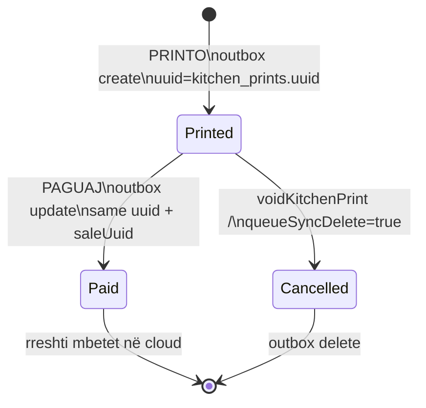
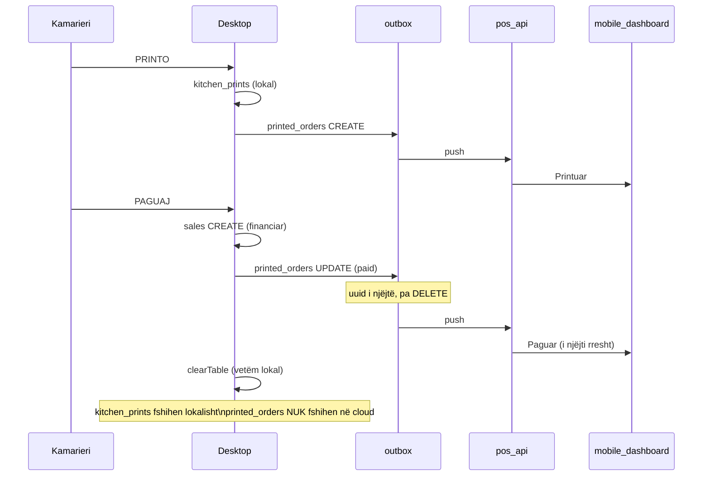

# 74 — Cikli i jetës: printed_orders (Printuar → Paguar)

**Data:** 2026-05-25  
**Projekti:** `pos_system`  
**Lidhur me:** [73_DESKTOP_PRINTED_ORDERS_SYNC.md](./73_DESKTOP_PRINTED_ORDERS_SYNC.md)

---

## Qëllimi

Një porosi e printuar (`printed_orders`) mbetet **e njëjta rresht në mobile** gjatë gjithë ciklit:

| Hapi desktop | Status sync | Mobile (e pritur) |
|--------------|-------------|-------------------|
| PRINTO | `printed` | Badge **Printuar** |
| PAGUAJ | `paid` + `saleUuid` | Badge **Paguar** (i njëjti uuid) |

**Jo** shitje e re operacionale. **Jo** fshirje pas pagesës. **Jo** revenue nga `printed_orders`.

---

## Diagram i ciklit





---

## Pse `printed_orders` ≠ `sales`

| | `printed_orders` | `sales` |
|--|------------------|---------|
| Qëllimi | Porosi operative / live | Regjistrim financiar |
| Revenue / overview | **Jo** | **Po** |
| PRINTO | create `printed` | — |
| PAGUAJ | update `paid` | create `completed` |
| UUID | `kitchen_prints.uuid` | `sales.uuid` (i veçantë) |

Mobile Orders lexon `printed_orders`. Raportet dhe overview lexojnë `sales`.

---

## Implementim (desktop)

| Skedar | Roli |
|--------|------|
| `lib/services/printed_order_sync_payload.dart` | Payload create / paidUpdate |
| `lib/services/database_service.dart` | Queue create/update; clear pa delete cloud |
| `lib/services/sync_push_payload_mapper.dart` | Map push; paid minimal |

### PRINTO

- `insertKitchenPrint` → outbox `printed_orders` **create**
- `entityUuid` = `kitchen_prints.uuid` (i qëndrueshëm)
- Idempotencë: `_hasOutboxEventForEntity` për `create`

### PAGUAJ

- `insertSaleWithLines` → `sales` si më parë
- `_linkPrintedOrdersToSale` → `printed_orders` **update** për çdo print të tavolinës
- Payload minimal:

```json
{
  "uuid": "a1b2…",
  "status": "paid",
  "saleUuid": "660e8400-…"
}
```

- **Mos** krijo `printed_orders` të ri në pagesë
- Idempotencë: një `update` pending për uuid

### clearTable / pas pagesës

- `clearCurrentOrder(..., queuePrintedOrderDeleteOnClear: false)` (default)
- `clearKitchenPrintsForTable(queueSyncDelete: false)` — fshin vetëm SQLite lokal
- Porosia **paguar** mbetet në cloud për historik mobile

### Kur lejohet DELETE sync

- `voidKitchenPrint` → `deleteKitchenPrint(queueSyncDelete: true)`
- Anulim manual / print i pavlefshëm

---

## Idempotencë

| Rast | Mbrojtje |
|------|----------|
| Retry PRINTO / sync | Mos përsërit `create` për të njëjtin `kitchen_prints.uuid` |
| Retry PAGUAJ | Mos përsërit `update` paid për të njëjtin uuid në të njëjtin txn |
| Shitje ekzistuese (`wasExisting`) | `_linkPrintedOrdersToSale` përsëri (rimarrje lidhjeje) |

---

## QA checklist

- [ ] PRINTO → mobile: **Printuar**, një rresht, `#orderNumber` i saktë
- [ ] PAGUAJ → i njëjti rresht → **Paguar**, `saleUuid` i plotë
- [ ] Pas pagesës porosia **nuk zhduket** nga Orders
- [ ] Dy PRINTO = dy uuid (dy rreshta) — jo duplicate për të njëjtin uuid
- [ ] Overview / revenue = vetëm nga `sales` (i pandryshuar)
- [ ] Printim termik / kitchen flow i pandryshuar
- [ ] Void PRINTO nga menaxheri → delete sync (opsional në mobile)

---

## Rollback

1. Revert commit desktop.
2. Outbox `printed_orders` pending mund të pastrohen nga sync diagnostics.
3. Cloud rows ekzistuese mbeten — API duhet upsert by uuid.

---

## Teste

```bash
flutter test test/printed_order_lifecycle_test.dart test/sync_push_payload_mapper_test.dart
```

---

*Fund i raportit.*
